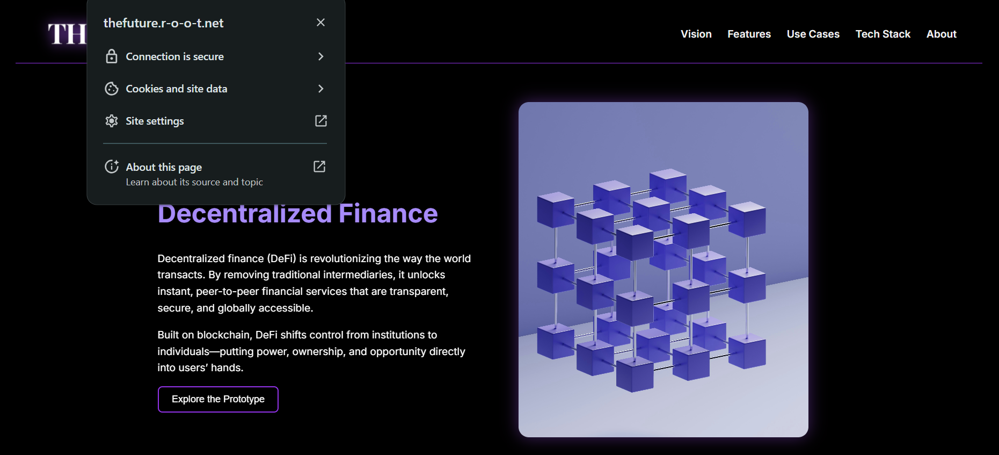

# Dynamic web application Prototype

This project is a dynamic, cloud-hosted landing page prototype created to showcase my technical skills in server provisioning, web server configuration, and full-stack deployment. It features a personalized landing page served via Nginx on an Ubuntu-based AWS EC2 instance, with enhancements such as reverse proxying and HTTPS security enabled through Let’s Encrypt.

- **Public IP** - 3.250.53.231
- **Live Site**: [thefuture.r-o-o-t.net](https://thefuture.r-o-o-t.net)  
- **Repo**: [GitHub - Startup-Landing-Prototype](https://github.com/Jeffery-Aifuwa/Startup-Landing-Prototype)

#### To explore or test the project locally:
```bash
git clone https://github.com/Jeffery-Aifuwa/Startup-Landing-Prototype.git
```


### Tech Stack

- AWS EC2 (Ubuntu 24.04)
- Nginx
- Node.js + Express
- PM2
- HTML & CSS
- Git & GitHub
- Certbot (Let’s Encrypt)


# Step-by-step procedure

### 1. **Server Provisioning**

- Launched an AWS EC2 t2.micro instance with Ubuntu 24.04.
- Configured the security group to allow ports 22, 80 and 443.

### 2. **Web Server Configuration**

- Installed nginx:
```
sudo apt update && sudo apt upgrade -y 
sudo apt install nginx -y
```
- Enabled nginx to start on boot:
```
sudo systemctl start nginx
sudo systemctl enable nginx
```
- Checked the status of nginx to ensure it is active:
```
sudo systemctl status nginx
```
- Input my public IP (3.250.53.231) into the browser for further confirmation
- Result:

- Installed Node.js:
```
sudo apt update
curl -fsSL https://deb.nodesource.com/setup_20.x | sudo -E bash -
sudo apt install -y nodejs
```
- Verified the installation:
```
node -v
npm -v
```
- Initialized node.js and installed Express:
```
npm init -y
npm install express
```
- Created a file named app.js and inputed some js commands
- Tested to confirm status and also tested by inputting the public address in my browser:
```
node app.js
```
- Installed PM2(A daemon process manager that will help you manage and keep your application online 24/7):
```
sudo npm install -g pm2
```
- Started app.js with PM2:
```
pm2 start app.js
```
- Made pm2 to restart the app on reboot, the command outputs another sudo command which I copied and ran:
```
pm2 startup
```
- Saved it with:
```
pm2 save
```
- Configured nginx as a reverse proxy
- Created a custom Nginx server block pointing to the project’s public directory
- Tested for syntax errors
```
sudo nginx -t
```
- Restarted nginx
```
sudo systemctl restart nginx
```
- Nginx successfully forwarded traffic to the Node.js app

### 3. **Dynamic Landing Page**

- Built a landing page with HTML & CSS
- Created a directory named "public" in the project folder
- Moved my landing page from my local machine to the AWS EC2 sever
```
scp -i ~/path/to/key.pem -r ./landing-page ubuntu@<EC2-IP>:~
```
- Moved the files to the public folder 
- Updated my app.js file with the built landing page to replace the placeholders
- Restarted pm2:
```
pm2 restart Startup-Landing-Prototype
```
- Curled localhost:3000 and also input my public ip on my browser and the page works fine

- Final Result:


### 4. **Networking & Security (Production-Ready)**

- Created a free domain to host my web page: [thefuture.r-o-o-t.net](https://thefuture.r-o-o-t.net)
- Installed certbot and nginx plugin
```
sudo apt update
sudo apt install certbot python3-certbot-nginx -y
```
- Set nginx block server to the domain name
- Tested and reloaded nginx
- Ran Certbot to obtain SSL certificate
```
sudo certbot --nginx -d thefuture.r-o-o-t.net
```
- The site is now secured with let's encrypt



# Challenges & Solutions

### 1. **File Upload Permission Errors (SCP)**

- **Challenge:** Encountered `Permission denied` errors when uploading files to `/home/ubuntu/Startup-Landing-Prototype` using `scp`.
- **Solution:** Uploaded files to the home directory using:
  ```
  scp -i "path-to-key.pem" -r your-folder ubuntu@your-server-ip:~
  ```

### 2. **File System Read-Only Mode**

- **Challenge:** The Startup-Landing-Prototype directory appeared with restricted permissions `(dr-x------)`, preventing file uploads.
- **Solution:** Deleted the directory and re-uploaded a fresh copy using scp, resolving the permission issue.

### 3. **Nginx Not Reflecting Changes**

- **Challenge:** After uploading new content, the site didn’t show updates.
- **Solution:**  Performed a hard refresh `(Ctrl + F5)` in the browser to clear the cache and load the new version.

### 4. **Missing Images After Upload**

- **Challenge:** Uploaded HTML and CSS files worked, but images didn’t show up on the live site.
- **Solution:** Zipped the entire landing page directory (including assets), transferred it via SCP, and then unzipped it on the server. This ensured all image files and folder structure remained intact.

### 5. **Missing Styles on Certain Sections**

- **Challenge:** The "Contact" section was not styled correctly after deployment.
- **Solution:**  Confirmed that style.css was uploaded and then hard-refreshed the browser, which restored the styling.

### 6. **Subdomain vs. IP Behavior**

- **Challenge:** The subdomain showed old content while the public IP returned a 404 error.
- **Solution:**  Verified the Nginx server block was properly configured for the subdomain and then refreshed the browser cache.

# Conclusion

This project demonstrates my ability to provision a cloud server, configure a web server, deploy a full-stack application, implement HTTPS using Let’s Encrypt, and troubleshoot deployment issues.
